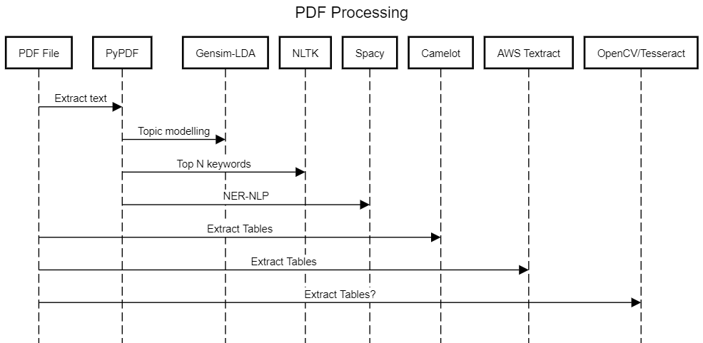

# Scrapdf

A Python library for scraping PDF documents. Capabilities include:

- Text extraction
- Topic modelling
- Entity recognition
- Table extraction

This library is fundamentally an aggregate of other popular Python PDF libraries with some opinionated implementations of the above utilities.

## Installation

`pip install scrapdf`
